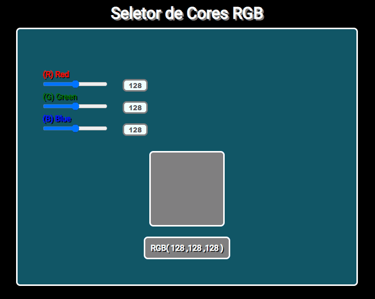

## Seletor de Cores RGB

<h3>✍️Objetivo</h3>

Desafio proposto em uma atividade pela ETEC de Embu, cujo objetivo foi trabalhar com DOM, eventos e funções..

🔗[Clique aqui para acessar](https://pedrodevvv.github.io/Timer-JS/)
## 🛠️Tecnologias

* JavaScript
* HTML
* CSS
* Visual Studio Code

## 📞 Contato

📩E-mail: pedrohgs2004@gmail.com  
🌐Linkedin: https://www.linkedin.com/in/pedro-henrique-g-silva-a2100a23a/?originalSubdomain=br
